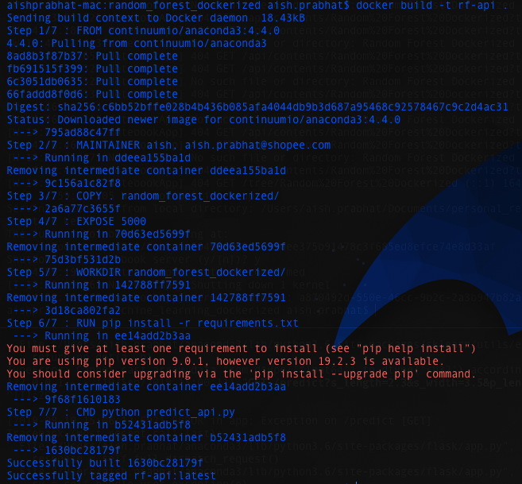

# Machine Learning Dockerized


## Dockerizing a Random Forest Model

### Description
A Random Forest model built to classify a flower using the [IRIS dataset](https://archive.ics.uci.edu/ml/datasets/iris). The model is exposed using Flask and then containerized using Docker.  

### Training, testing and exporting the model
Refer to `random_forest_dockerized/Train and Export Model.ipynb`

- First we will load the dataset
- Split into training, validation 
- Train the model
- Test model performance on certain metrics
- Store the model in a pickle file


### Exposing model through Flask and Flasgger

Refer to `random_forest_dockerized/predict_api.py`

```
import pickle
from flask import Flask, request, jsonify
from flasgger import Swagger
import numpy as np
import pandas as pd

with open('iris_model.pkl', 'rb') as model_file:
    model = pickle.load(model_file)

app = Flask(__name__)
swagger = Swagger(app)

@app.route('/predict')
def predict_iris():
    """Example endpoint returning a prediction of iris
    ---
    parameters:
      - name: s_length
        in: query
        type: number
        required: true
      - name: s_width
        in: query
        type: number
        required: true
      - name: p_length
        in: query
        type: number
        required: true
      - name: p_width
        in: query
        type: number
        required: true
    responses:
      200:
        description: Index of predicted class 

    """
    s_length = float(request.args.get("s_length"))
    s_width = float(request.args.get("s_width"))
    p_length = float(request.args.get("p_length"))
    p_width = float(request.args.get("p_width"))
    
    print("Predicting!")
    prediction = model.predict(np.array([[s_length, s_width, p_length, p_width]]))
    # print(prediction)

    print("Returning Prediction")
    return str(prediction)

@app.route('/predict_file', methods=["POST"])
def predict_iris_file():
    """Example file endpoint returning a prediction of iris
    ---
    parameters:
      - name: input_file
        in: formData
        type: file
        required: true
    """
    input_data = pd.read_csv(request.files.get("input_file"), header=None)
    prediction = model.predict(input_data)
    return str(list(prediction))

if __name__ == '__main__':
    app.run(host='0.0.0.0', port=5000)
```
    
### Testing the app

- Ensure that you have the necessary packages installed (flask, fassger, sklearn)
- Ensure that you are in the `random_forest_dockerized/` directory and run `python predict_api.py`
 
- Open your browser and go to `http://localhost:5000/apidocs`. You should see something like this:
 
- Click on `Try it out` and enter values into the fields and press `Execute`
- You should see something like this. You can see the prediction in the `Response body` section:
 


### Writing a Dockerfile to create an Image

Refer to `random_forest_dockerized/Dockerfile`

```
FROM continuumio/anaconda3:4.4.0
MAINTAINER aish, aish.prabhat@shopee.com
COPY . random_forest_dockerized/
EXPOSE 5000
WORKDIR random_forest_dockerized/
RUN pip install -r requirements.txt
CMD python predict_api.py
```

### Build a Docker Image
Ensure you are in the `random_forest_dockerized/` directory and run `docker build -t rf-api .`
It should look something like this:



### Running a Container

- Run `docker run -p 4000:5000 rf-api`
- Now open your browser and go to `http://localhost:4000/apidocs`. You should be able to see something like: 

- Click on `Try it out` and enter values into the fields and press `Execute`
- You should see something like this. You can see the prediction in the `Response body` section:
 


## Multi-Container App using Docker Compose

### Making changes to our Flask API

Refer to `random_forest_dockerized/predict_redis_api.py`

```
import pickle
from flask import Flask, request, jsonify
from flasgger import Swagger
import numpy as np
import pandas as pd
import redis

with open('iris_model.pkl', 'rb') as model_file:
    model = pickle.load(model_file)

app = Flask(__name__)
swagger = Swagger(app)


redis_host = "redis-server"
redis_port = 6379
redis_password = ""

prediction_index = 0

@app.route('/predict')
def predict_iris():
    """Example endpoint returning a prediction of iris
    ---
    parameters:
      - name: s_length
        in: query
        type: number
        required: true
      - name: s_width
        in: query
        type: number
        required: true
      - name: p_length
        in: query
        type: number
        required: true
      - name: p_width
        in: query
        type: number
        required: true
    responses:
      200:
        description: Index of predicted class 

    """
    global prediction_index
    s_length = float(request.args.get("s_length"))
    s_width = float(request.args.get("s_width"))
    p_length = float(request.args.get("p_length"))
    p_width = float(request.args.get("p_width"))
    
    print("Predicting!")
    prediction = model.predict(np.array([[s_length, s_width, p_length, p_width]]))
    # print(prediction)

    prediction_index+=1
    r = redis.StrictRedis(host=redis_host, port=redis_port, password=redis_password, decode_responses=True)
    r.set(str(prediction_index),str(prediction))

    print("Returning Prediction")
    return str(prediction)

@app.route('/predict_file', methods=["POST"])
def predict_iris_file():
    """Example file endpoint returning a prediction of iris
    ---
    parameters:
      - name: input_file
        in: formData
        type: file
        required: true
    """
    input_data = pd.read_csv(request.files.get("input_file"), header=None)
    prediction = model.predict(input_data)
    return str(list(prediction))

if __name__ == '__main__':
    app.run(host='0.0.0.0', port=5000)
```

### New Dockerfile

Small change in previous docker file - refer to `random_forest_dockerized/Dockerfile_with_redis`

```
FROM continuumio/anaconda3:4.4.0
MAINTAINER aish, aish.prabhat@shopee.com
COPY . random_forest_dockerized/
EXPOSE 5000
WORKDIR random_forest_dockerized/
RUN pip install -r requirements.txt
CMD python predict_redis_api.py
```

### Writing Docker Compose file

Refer to `random_forest_dockerized/Dockerfile_with_redis` 

```
version: '3'
services:
  redis-server:
    image: 'redis'
  flask-app:
    build:
      context: .
      dockerfile: Dockerfile_with_redis
    ports:
      - "5000:5000"
    restart: always
```

### Running Containers

While in the `random_forest_dockerized/` directory, run `docker-compose up --build`


    
    
    
    
